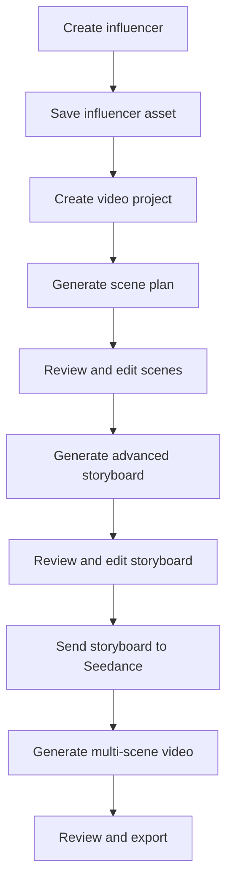

# Marsfield Influencer Workflow: Developer Specification

## Objective

Build a new Marsfield workflow that allows users to:

1. Create a reusable AI influencer.
2. Save the influencer as an asset.
3. Develop a video idea into editable scenes.
4. Review and modify the scene plan.
5. Generate one advanced visual storyboard showing the influencer performing each scene.
6. Use that single storyboard as the primary visual input for Seedance.
7. Generate one consistent, multi-scene social video.
8. Review, regenerate and export the final video.

The advanced storyboard is not just a planning document. It is the main visual reference Seedance uses to understand the character, scenes, actions, wardrobe, camera framing and narrative sequence.

---

## Primary User Flow



---

# Module 1: Influencer Creator

## Purpose

Allow users to create a consistent fictional influencer that can be reused across multiple projects.

## Creation Methods

Users can create an influencer through:

* A written description
* A generated starting character
* Uploaded reference images
* A combination of uploaded references and written instructions

## Influencer Fields

### Basic information

* Influencer name
* Gender presentation
* Age range
* Content niche
* Personality
* Speaking style
* Location or cultural context
* Short fictional biography

### Appearance

* Skin tone
* Face shape
* Eye colour
* Hair colour
* Hair style
* Hair texture
* Body type
* Height range
* Makeup or grooming
* Distinguishing features
* Default wardrobe style

### Content identity

* Primary social platform
* Visual style
* Typical environments
* Camera personality
* Voice style
* Content tone
* Brand categories
* Restricted subjects

## Influencer Generation

The system generates an influencer preview based on the selected attributes.

The user can:

* Approve the influencer
* Edit the description
* Generate variations
* Upload additional references
* Select the final appearance

## Influencer Asset

When approved, save the influencer as a reusable asset containing:

```json
{
  "id": "influencer_uuid",
  "name": "Maya",
  "description": "Full canonical character description",
  "personality": "Confident, warm and energetic",
  "content_niche": ["fitness", "wellness"],
  "appearance": {
    "age_range": "25-30",
    "skin_tone": "medium brown",
    "hair": "long dark curly hair",
    "body_type": "athletic",
    "default_style": "modern fitness lifestyle"
  },
  "reference_images": [],
  "primary_reference_image": "",
  "voice_id": null,
  "default_wardrobe": "",
  "visual_style": "",
  "created_at": ""
}
```

The asset must appear inside the user’s Marsfield asset library and be selectable in future projects.

---

# Module 2: Create Influencer Video Project

## Project Setup

The user selects:

* Saved influencer
* Video idea
* Product or service
* Product reference images
* Target platform
* Video length
* Aspect ratio
* Content format
* Video objective
* Target audience
* Call to action
* Dialogue or voiceover preference

## Supported Content Formats

* Day in the life
* Gym or fitness routine
* Product demonstration
* UGC advertisement
* Testimonial-style video
* Tutorial
* Product unboxing
* Lifestyle promotion
* Talking-head video
* Story-based advertisement

## Example User Input

> Maya goes to the gym before work and promotes a natural pre-workout supplement as part of her morning routine.

---

# Module 3: Scene Planning

## Purpose

Convert the user’s idea into a structured sequence before generating the advanced storyboard.

The AI should return:

* Creative angle
* Hook
* Narrative structure
* Script
* Scene list
* Product integration
* Call to action

## Scene Data Structure

```json
{
  "project_id": "project_uuid",
  "title": "Maya's Morning Gym Routine",
  "creative_angle": "Overcoming low morning energy",
  "scenes": [
    {
      "scene_number": 1,
      "title": "The struggle",
      "duration_seconds": 2,
      "location": "Modern bedroom",
      "description": "Maya sits on the edge of her bed looking tired.",
      "character_action": "Checks the time on her phone and takes a breath.",
      "expression": "Tired and reluctant",
      "wardrobe": "Black gym outfit",
      "camera_framing": "Medium shot",
      "camera_movement": "Slow push-in",
      "lighting": "Soft early morning light",
      "product_visible": false,
      "dialogue": "",
      "voiceover": "Getting to the gym is always the hardest part.",
      "on_screen_text": "6:00 AM",
      "transition": "Quick cut"
    }
  ]
}
```

---

# Module 4: Scene Editor

## Interface

Display scenes as ordered cards or timeline items.

Each scene card should show:

* Scene number
* Scene title
* Description
* Duration
* Location
* Character action
* Wardrobe
* Camera framing
* Camera movement
* Dialogue
* Voiceover
* Product placement
* Transition

## User Actions

Users must be able to:

* Add a scene
* Delete a scene
* Duplicate a scene
* Reorder scenes
* Edit any scene field
* Rewrite a scene with AI
* Shorten or expand a scene
* Change the camera angle
* Change the action
* Change the location
* Apply wardrobe changes to all scenes
* Apply location changes to selected scenes
* Regenerate the full scene plan
* Approve the scene plan

The advanced storyboard cannot be generated until the user approves the scene plan.

---

# Module 5: Advanced Storyboard Generator

## Purpose

Generate one polished storyboard image that contains all approved scenes and depicts the saved influencer performing the intended actions.

This storyboard will become the primary visual reference sent to Seedance.

## Storyboard Requirements

The storyboard must:

* Use the saved influencer in every relevant panel
* Preserve the influencer’s face, body and hair
* Show scenes in chronological order
* Depict the intended action in every scene
* Maintain wardrobe continuity
* Maintain product consistency
* Match the specified location
* Match the requested camera framing
* Match the intended lighting
* Use clearly separated numbered panels
* Avoid captions covering important visual information
* Match the final video’s aspect ratio and composition
* Use consistent visual quality across all panels

## Recommended Layouts

The system should choose a layout based on scene count:

| Scenes | Layout |
| -----: | ------ |
|    3–4 | 2 × 2  |
|    5–6 | 3 × 2  |
|    7–9 | 3 × 3  |

Set an MVP maximum of six scenes to preserve sufficient detail in each panel.

## Storyboard Labels

Each panel should include small production labels:

* Scene number
* Duration
* Camera framing
* Short action description

Labels should be positioned outside the main visual area where possible.

## Storyboard Generation Prompt

The storyboard prompt must be assembled from:

* Canonical influencer description
* Influencer reference image
* Product references
* Approved scenes
* Wardrobe rules
* Location rules
* Visual style
* Aspect ratio
* Continuity requirements

Example prompt structure:

```text
Create one advanced six-panel production storyboard for a vertical social video.

Use the person in the supplied influencer reference as the same main character in every panel. Preserve her exact facial identity, age, complexion, hairstyle, body proportions and defining features.

The panels must be clearly separated, numbered 1 through 6 and read from left to right, top to bottom.

Maintain the same black gym outfit throughout the entire storyboard. Preserve the supplied supplement packaging wherever the product appears.

Panel 1:
[Structured scene description]

Panel 2:
[Structured scene description]

Continue for all approved scenes.

Visual style:
Photorealistic premium UGC, natural smartphone cinematography, realistic skin, believable environments, consistent colour treatment.

Continuity requirements:
The same person, hairstyle, outfit, product design and narrative timeline must be maintained across all panels.

Do not introduce additional characters, clothing changes, duplicated objects, unreadable panel organization or unexplained location changes.
```

## Storyboard Output Data

```json
{
  "storyboard_id": "storyboard_uuid",
  "project_id": "project_uuid",
  "version": 1,
  "image_url": "",
  "scene_count": 6,
  "layout": "3x2",
  "prompt": "",
  "status": "completed",
  "approved": false,
  "created_at": ""
}
```

---

# Module 6: Storyboard Review

## User Actions

After the storyboard is generated, the user can:

* Approve the storyboard
* Regenerate the entire storyboard
* Edit the underlying scene plan
* Change the visual style
* Strengthen character consistency
* Strengthen product consistency
* Change wardrobe
* Change individual scene descriptions
* Generate a new storyboard version
* Compare storyboard versions
* Select the final version

Because Seedance will use one storyboard, changes to an individual panel should trigger regeneration of the complete storyboard. This prevents edited panels from appearing visually disconnected from the rest of the board.

## Versioning

Never overwrite an approved or previously generated storyboard.

Store:

* Version number
* Prompt
* Scene data
* Influencer version
* Product references
* Generated image
* Creation date
* Approval state

---

# Module 7: Seedance Video Generation

## Purpose

Use the approved advanced storyboard as the visual blueprint for one multi-scene video generation.

## Seedance Inputs

Send:

* Approved storyboard image
* Complete video prompt
* Desired duration
* Aspect ratio
* Resolution
* Audio preference
* Optional influencer reference image
* Optional product reference image, if supported by the selected endpoint

The storyboard remains the primary visual input. Other references reinforce identity and product details where the API permits them.

## Seedance Prompt Construction

The video prompt should not recreate the scenes from scratch. It should tell Seedance how to interpret and animate the storyboard.

Example:

```text
Generate one continuous 15-second vertical social video based on the supplied six-panel storyboard.

Follow the storyboard panels in numerical order from left to right and top to bottom. Treat each panel as the visual blueprint for one consecutive shot.

Preserve the exact identity of the woman depicted throughout the video. Maintain the same face, complexion, hairstyle, body proportions and black gym outfit across every shot.

Animate the actions shown in each panel naturally:

Scene 1, 0–2 seconds:
Maya sits tiredly on the edge of her bed, checks her phone and takes a breath. Use a slow camera push-in.

Scene 2, 2–5 seconds:
She enters the kitchen and mixes the referenced supplement into her water bottle. Use a close-up of the product and her hands.

[Continue for every scene.]

Maintain chronological continuity, realistic human movement, consistent locations, natural transitions and premium UGC smartphone cinematography.

Preserve the product’s packaging, colours, shape and scale wherever it appears.

Do not change the character’s face, hairstyle, age, wardrobe or body shape. Do not reorder, combine, skip or invent scenes.
```

## Generation Status

Support these states:

```text
draft
storyboard_generating
storyboard_ready
storyboard_approved
video_queued
video_generating
video_ready
video_failed
```

Use asynchronous processing and polling or webhooks because video generation may take several minutes.

---

# Module 8: Video Review and Export

## Review Screen

Display:

* Final video
* Approved storyboard
* Scene plan
* Generation prompt
* Generation settings
* Cost or credits used

## User Actions

* Approve video
* Regenerate video from the same storyboard
* Adjust motion instructions
* Adjust video prompt
* Change duration
* Change audio settings
* Return to scene planning
* Generate a new storyboard
* Download video
* Save project
* Duplicate project
* Create a variation

If the video is regenerated from the same storyboard, the storyboard must remain unchanged unless the user deliberately returns to the storyboard stage.

---

# Product and Brand Assets

Products should be saved separately from influencer assets.

## Product Asset Fields

```json
{
  "id": "product_uuid",
  "name": "Natural Energy Supplement",
  "description": "",
  "reference_images": [],
  "primary_reference_image": "",
  "brand_name": "",
  "approved_claims": [],
  "restricted_claims": [],
  "brand_colours": [],
  "logo_url": "",
  "created_at": ""
}
```

The user can attach a saved product asset to any influencer video project.

---

# Suggested Database Tables

```text
influencers
influencer_references
products
product_references
video_projects
project_scenes
storyboards
storyboard_versions
video_generations
generation_jobs
user_assets
```

## Important Relationships

* One user has many influencers.
* One influencer has many reference assets.
* One influencer can appear in many projects.
* One project contains many scenes.
* One project can have many storyboard versions.
* One approved storyboard can have many video generations.
* One project can reference one or more products.

---

# MVP Scope

## Include

* Influencer creation
* Influencer asset library
* Product asset upload
* Video brief
* AI-generated scene plan
* Editable scene cards
* Maximum six scenes
* Single advanced storyboard generation
* Storyboard versioning
* Storyboard approval
* Seedance integration
* One multi-scene video generation
* Regeneration
* Download and project duplication

## Exclude From MVP

* Multiple influencers in one video
* Influencer conversations
* Automated publishing
* Full timeline video editor
* Scene-level video replacement
* Complex lip-sync editing
* Long-form videos
* Multiple products interacting in one shot
* Automatic ad campaign generation

---

# Acceptance Criteria

The feature is complete when a user can:

1. Create and save a recognizable influencer.
2. Select that influencer for a new video project.
3. Enter a simple content idea.
4. Receive a structured multi-scene concept.
5. Edit, add, remove and reorder scenes.
6. Approve the scene plan.
7. Generate one storyboard showing the correct influencer in every panel.
8. regenerate and compare storyboard versions.
9. Approve one storyboard.
10. Submit that storyboard to Seedance.
11. Generate one multi-scene video following the storyboard sequence.
12. Regenerate the video without recreating the storyboard.
13. Download the completed video.
14. Reuse the influencer in a completely new project.

The central implementation rule is:

> Marsfield plans the scenes first, generates one unified visual storyboard second, and uses that storyboard to direct one multi-scene Seedance video generation.
