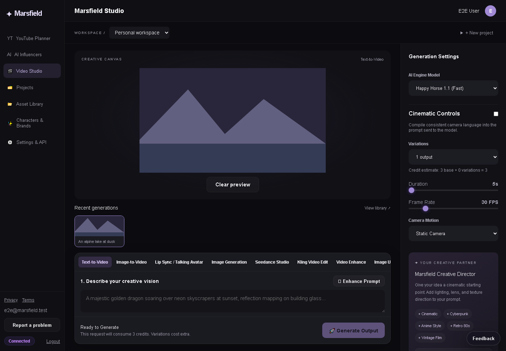
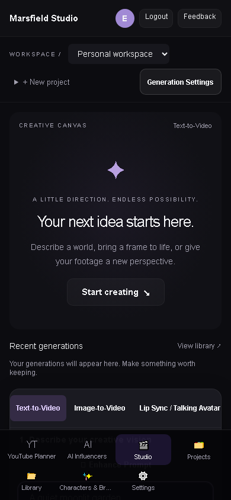
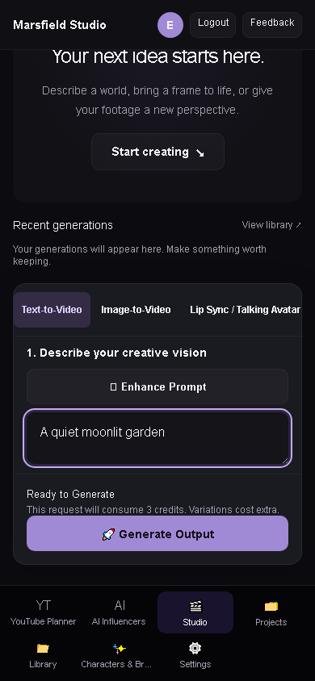

# Marsfield Studio workspace

The Studio route uses a compact navigation sidebar, project bar, central media canvas, recent asset strip, bottom prompt composer, and contextual Generation Settings inspector. At widths of 1180px and below, the inspector opens from the project bar; mobile navigation remains available at the bottom of the screen.

All ten workflows retain their existing model controls, upload and owned-asset selection, pricing, generation, polling, result actions, and storyboard handoff. Recent assets use the existing library endpoint and refresh after generation completes. Selecting a recent asset previews it without starting a paid generation.

Marsfield Creative Director reuses the existing local prompt enhancement and style suggestions. It does not call an additional AI service or consume extra credits.

The visual styles are scoped to the Studio route in `frontend/src/app/studio.css`. Existing route layouts are unchanged.

## Verification

Run `npm run prisma:generate --workspace=backend` after installing dependencies, then run `npm run build`, `node --test backend/test/*.test.js`, and `npm run test:e2e`.

`e2e/studio-workspace.spec.ts` covers project assignment and prompt direction in the generation payload, recent asset previews, a fully visible Generate button at 1280×720, and mobile inspector access. Set `STUDIO_SCREENSHOT_DIR` to an output directory when running that test to regenerate the screenshots.

The Studio page and root layout pass the repository's changed-file lint check. The workspace uses typed project and generation data, clears session state on sign-out, and ties credit quotes to the current source and settings so outdated responses cannot enable generation. `e2e/studio-quote.spec.ts` covers quote changes and session cleanup. The full frontend lint baseline still contains errors in unrelated pages.

## Screenshots

These screenshots use mocked API responses and a synthetic landscape asset, not a live generation or customer data.

